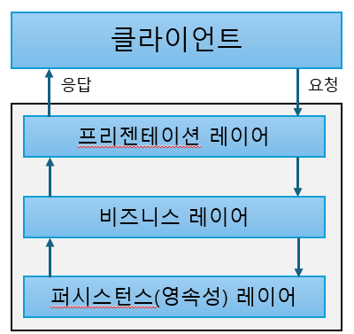
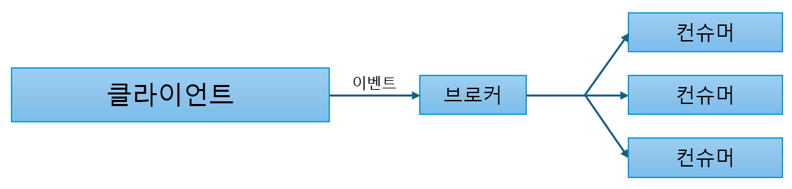
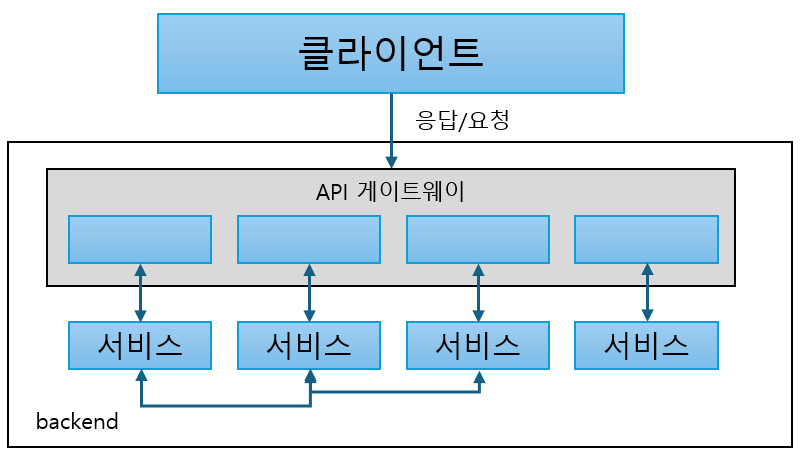
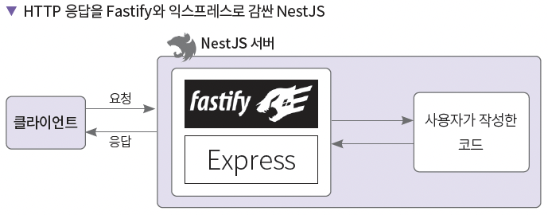
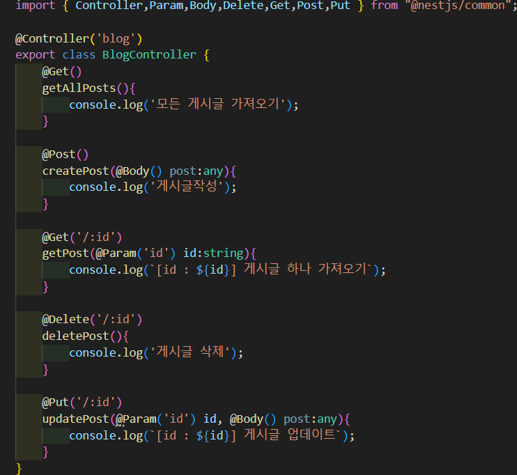
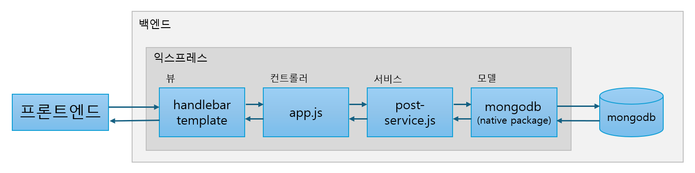
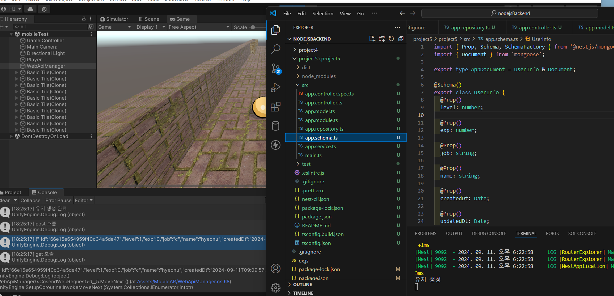

# Node.js 백엔드 공부 정리

## 백엔드 아키텍처
#### 계층형 아키텍처 (layered architecture)
- 각 계층이 논리적으로 분리되어 있기 때문에 소규모 애플리케이션에 많이 채택
- 각 계층은 주여진 역할 수행, 의존성 : 단방향
- 코드 복잡도 ↓ 응집도 ↑ , 테스트 쉬움
- but 규모가 커지게 되면 계층 거대해짐 -> 유지보수 힘듬 / 개발속도 ↓
- 적용 예시 : TCP/IP 네트워크 계층

 

#### 이벤트 기반 아키텍처 (event-driven architecture)
- 프로듀서/브로커/컨슈머 로 구성, 모든 요청 비동기로 처리
- 확장성이 좋고 컴포넌트 간 의존성 ↓
- but 이벤트 순서 보장 어려움
- (ex : node.js는 이벤트기반 아키텍처)

 

#### 마이크로서비스 아키텍처 (microservices architecture)
- 시스템을 여러개의 작은 서비스로 나누어 관리
- 서비스는 독립적으로 개발/배포/운영
- 각 서비스는 독립적으로 업데이트 및 스케일링 가능, 구조 간결 및 확장성 좋음
- 대규모 시스템 구축 시 유용

 

## 데이터베이스
#### RDB
- ACID (원자성, 일관성, 격리성, 내구성)
- 데이터 저장/질의/수정/삭제 용이, but 성능 올리기 쉽지 않음
- 소규모 서비스에 적합

#### NOSQL
규모가 커지면 키 밸류 캐시, 키 밸류 스토어, 도큐먼트 스토어 사용 
- RDB의 문제를 해결하기 위해 등장
- 키 밸류 캐시 : 멤캐시드와 레디스가 많이 사용됨
- 키 밸류 스토어 : 다이나모디비, 카우치베이스
- 도큐먼트 스토어 : 몽고디비 (ex : 피파온라인 데이터베이스)
  
>몽고디비
> - 데이터 포맷 - BSON (binary JSON)
> - 장점 : 데이터 유연성 및 RDB보다 빠른 성능
> - 단점 : 메모리/디스크 많이 사용함, 트랜잭션이 RDB에 비해 약함

>몽구스
> - 네이티브 드라이버인 몽고디비보다 조금 더 편리한 기능 제공
> - ex : ODM (객체 -> 도큐먼트 매핑)  - 스키마 지정 및 유효성 검증 편리

#### 클라우드 서비스
- IaaS - 서버 인프라 환경 서비스
- PaaS - 앱 개발 및 실행환경 제공
- SaaS - 브라우저 기반으로 소프트웨어 사용할 수 있게
- ex : AWS, Azure, GCP

## NestJS

익스프레스는 최소한의 기능을 제공하는 반면,
NestJS는 상대적으로 더 많은 기능 제공

웹 서버 프레임워크의 아키텍처 문제를 효과적으로 해결하는 것이 NestJS의 목표

(출처 : https://goldenrabbit.co.kr/2023/06/05/nestjs/)

 

|-|**Express**|**NestJS**|
|:------:|:------:|:------:|
|**소개**|미니멀리스트 웹 프레임워크|상업용 서버 애플리케이션 구축을 목표로 하는 프레임워크|
|**라우터**|직접 추가하거나 미들웨어 사용|@Controller() 데코레이터 사용|
|**의존성 주입**|없음|의존성 주입 기능 제공, 서비스와의 의존 관계 관리 쉬움|
|**에러 핸들링**|직접 에러처리 해야 함|@Catch() 데코레이터 사용|
|**테스트**|직접 도구 설치 및 실행 해야함|jest 기반 내장 테스트 모듈 제공|
|**아키텍처**|없음|컨트롤러, 프로바이더, 모듈을 사용한 애플리케이션 아키텍처 제공|

아래 예시는 NestJS를 사용할 때 예제이다.

데코레이터를 사용하므로, 확실히 익스프레스만 사용할 때보다 더 직관적이고 쉽게 코드를 작성할 수 있다.

 

~~익스프레스는 아래처럼 써야 한다~~

`
app.get("/write", (req, res) => {
  res.render("write", { title: "테스트 게시판", mode: "create" });
});
`

`
app.post("/write", async (req, res) => {
  const post = req.body;
  const result = await postService.writePost(collection, post);
});
`

# 환경변수 설정
 1. app.module.ts 에 ConfigModule 설정
 2. .env 파일 생성
 3. app.controller.ts에 테스트 라우팅 함수 추가

(env_test 폴더 참조)

> **추가**
> - 민감한 환경 변수 (AWS 키값 등..)은 valut 와 같은 외부 저장소에 저장한다
> - yaml 설정도 알아두자. ( nodejsBackend\env_test\config-test\src\configs\config.ts )

# 인증 및 유효성 검사

Strategy 생성 및 Guard 로직 추가

구글 외부 인증 로그인도 가능하다

(auth_test 폴더 참조) 

# project 1. CRUD 게시판
MVC 패턴

 

mongodb + express 사용

댓글 및 페이지네이션 되는 간단한 CRUD  게시판

# project 2. Blog API 구현

NestJS, Typescript 로 간단한 API 구현

# project 3. 파일업로드

multer 패키지 (파일 업로드에 사용되는 nodejs 라이브러리) 사용

# project 4. 웹소켓 실시간 채팅

websockets 라이브러리 이용한 실시간 채팅

# project 5. Game userinfo api

유니티 게임 서버 api 구현

 

post / get 요청이 잘 되는 걸 확인할 수 있다